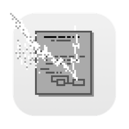

# WorldWideWeb Cocoa

An experimental Cocoa port of Tim Berners-Lee's original [WorldWideWeb](https://en.wikipedia.org/wiki/WorldWideWeb) web browser from the early 1990s.

> [!IMPORTANT]
> This project is still in its early stages and, while it compiles, is still largely non-functional. Anyone interested is highly encouraged to explore the codebase and hack on it though.

## Background

This port is mainly motivated by academic curiosity, specifically learning about the implementation of the first web browser (how HTML rendering works etc.) and the history of the NeXTStep API. The goal is to eventually have a working Cocoa application that stays faithful to the original code and design while adopting modern conventions where they make sense[^1]. This is not a small goal and may even be infeasible given the complexity of the project and potential need to replace or reimplement removed APIs.

### The NeXTStep API vs. Cocoa/AppKit

While the original NeXTStep API and modern AppKit still share substantial similarities, many things have changed over the last 30 years. The most noticeable difference is perhaps the `NS` prefix, which replaced the older `NX` prefix. More subtle changes exist too, specifically classes like [`NSParagraphStyle`](https://developer.apple.com/documentation/uikit/nsparagraphstyle?language=objc) or [`NSText`](https://developer.apple.com/documentation/appkit/nstext), which are more encapsulated than back in the NeXTStep days. Although good from a software design standpoint, these differences unfortunately complicate the migration, because much of the original rendering engine (see e.g. the [`HyperText`](https://github.com/fwcd/worldwideweb-cocoa/blob/8418220bc109a5ae43c257f94e9a74f3dd141534/WorldWideWeb/HyperText.m) class) relies on these internals of NeXTStep's [`Text`](https://www.nextop.de/NeXTstep_3.3_Developer_Documentation/GeneralRef/02_ApplicationKit/Classes/Text.htmld/index.html) and related classes.

Fortunately, [`NSTextView`](https://developer.apple.com/documentation/appkit/nstextview), [`NSTextStorage`](https://developer.apple.com/documentation/appkit/nstextstorage) and [`NSAttributedString`](https://developer.apple.com/documentation/foundation/nsattributedstring), the classes taking on these responsibilities in modern Cocoa, still map surprisingly well to the NeXTStep API on a conceptual level. Additionally, Cocoa's attributed strings handle many things under the hood that previously had to be done manually, such as merging attribute ranges.

For more information, see [issue #2](https://github.com/fwcd/worldwideweb-cocoa/issues/2).

### The Interface Builder NIB Format

Another major hurdle to overcome is the legacy Interface Builder NIB format. This format has changed a few times over the years, from the original `NXTypedStream` (see [this Python reimplementation](https://github.com/dgelessus/python-typedstream)) to the modern XML-based XIB format. While Xcode is capable of reading older versions of the XML-based format, the [`WorldWideWeb.nib`](https://github.com/fwcd/worldwideweb-cocoa/tree/4276fe7bd1e70c24a6d70fc96a13e06aa5f6fc67/WorldWideWeb/WorldWideWeb.nib) turned out to be too old even for versions of Project Builder, the predecessor of Xcode. Our approach here is to use [a custom Python script](Scripts/convert-nib-to-xib) to convert the legacy NIB to a modern XIB.

More information on this can be found in [issue #1](https://github.com/fwcd/worldwideweb-cocoa/issues/1).

### Further Reading

- https://www.w3.org/People/Berners-Lee/WorldWideWeb.html
- https://worldwideweb.cern.ch/code/
- https://en.wikipedia.org/wiki/WorldWideWeb

## Project Structure

This Cocoa port uses a standard Xcode project ([`WorldWideWeb.xcodeproj`](WorldWideWeb.xcodeproj)). The source code can be found under [`WorldWideWeb`](WorldWideWeb) and a few helper scripts (e.g. for the NIB-to-XIB conversion) under [`Scripts`](Scripts).

A few files that are not really used anymore, but kept around out of historical interest and for reference purposes can be found in the [`Legacy`](Legacy) folder. This includes the original Makefiles, Project Builder projects and the legacy NIB that we generate the modern XIB from.

[^1]: A specific example of this is the menu bar. On NeXTStep, the main menu (i.e. the root of the menu hierarchy) was displayed as a single menu, while on macOS the "main menu" is actually the menu bar. This subtility results in slightly different conventions, e.g. on macOS it would be very uncommon for the menu bar to contain a menu item that directly represents an action such as "Print" or "Quit" and not a submenu itself. We deal with this by moving the top-level actions into the application menu (i.e. "WorldWideWeb") during the conversion from NIB to XIB. More details and screenshots can be found in [#1](https://github.com/fwcd/worldwideweb-cocoa/issues/1).
