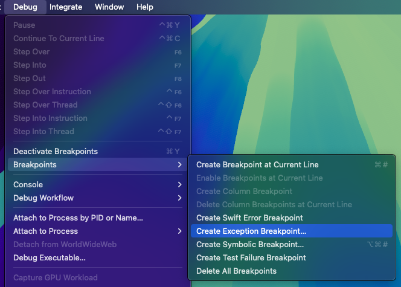

# Troubleshooting

## Exceptions in menu actions

When debugging this project in Xcode, it is often useful to set a breakpoint on Objective-C exceptions, since any exceptions originating in AppKit menu bar actions will otherwise just log to the console and not pause the debugger:

